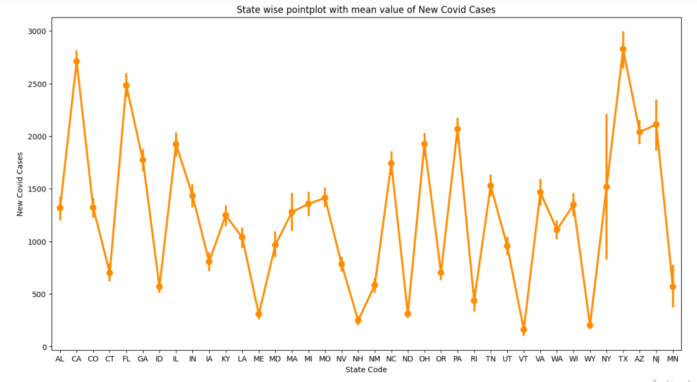
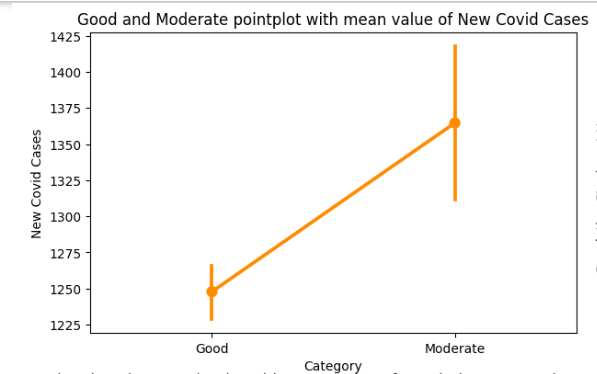
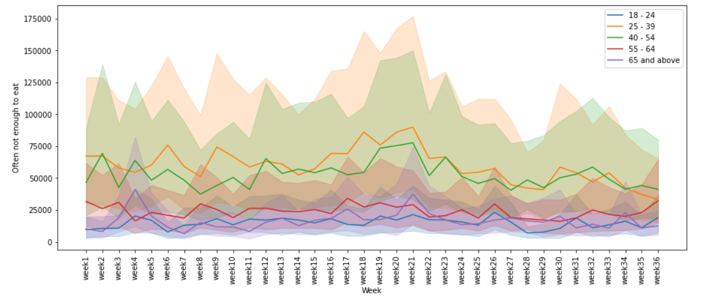
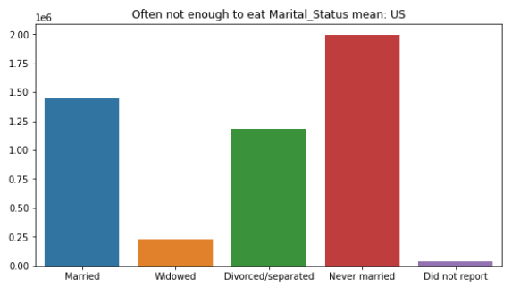

# IMPACT OF COVID-19 ON THE USA AIR POLLUTION AND FOOD INSECURITY

This research was carried out to know the impact of Covid-19 on the USA Air pollution and Food Insecurities.

## Introduction

Since its discovery in Wuhan, China, in December 2019, the global pandemic known as Coronavirus disease 2019 (COVID-19) has had a significant impact on society and daily life, beginning in 2019 and intensifying significantly from 2020 to the foreseeable in ways that haven't been seen in recent years.
Its implications on food and air have been extremely significant, leading to higher rates of food insecurity and improved air quality.

## Prerequisites to get started:

* Python
* Numpy
* Pandas
* Matplotlib
* Seaborn
* Scikit-learn

## Aim

There are two objectives for the project.

* The primary one is to determine what effect COVID-19 has had on the USA air pollution.
* The secondary objective is to figure out how the COVID-19 has influenced the USA food insecurity and to provide analysis to forecast a similar situation in the future.

## Purpose

The objective of this study is to promote awareness among the people about how air pollution has indeed been reduced as a result of individuals reduced outdoor mobility for a prolonged period during the outbreak and to assess how widespread food insecurity was.

## Data collection

Data collection:
1. US counties COVID-19 dataset: “(https://github.com/nytimes/covid-19-data/tree/master/live)" 
2. Covid-19 Food Insecurity Data: “(https://www.kaggle.com/datasets/jackogozaly/pulse-survey-food-insecurity-data?resource=download)” 
3. US-Environment air pollution: United States Environmental Protection Agency (https://aqs.epa.gov/aqsweb/airdata/download_files.html)
4. Trips by Distance: U.S. Department of Transportation (https://data.bts.gov/Research-and-Statistics/Trips-by-Distance/w96p-f2qv)

Download the datasets used <a href="https://drive.google.com/file/d/1oo0rM7vc0oKXfJ4ACQOGy6xXMQVc_TOP/view?usp=share_link">here</a>

## Data description:
##### Air Pollutants merged with Covid 19: 

* This dataset consists of information related to date, state, number of Covid cases, pollutants, meteorological features, population staying and not staying at home, number of Trips effecting AQI.

##### Food Insecurity merged with Covid 19:

* This dataset consists of survey information such as  “Enough of the kinds of food wanted”, “Enough Food, but not always the kinds wanted”, “Sometimes not enough to eat”, “Often not enough to eat” across different gender, race etc. along with Covid 19 cases.

## Feature Selection

##### Feature selection for air pollution(Dataset 1):
**Dependent variable**: AQI 
**Independent variables**: 'New Covid Cases', 'Population Staying at Home’, 'Population Not Staying at Home', 'Number of Trips', 'pm10_mean’, 'pm25_mean', 'co_mean', 'no2_mean', 'o3_mean', 'so2_mean', 'press_mean', 'rh_mean', 'temp_mean', 'wind_mean'

##### Feature selection for food insecurity (Dataset 2):
**Dependent variable**: Enough of the kinds of food wanted', 'Enough Food, but not always the kinds wanted', 'Sometimes not enough to eat', 'Often not enough to eat’ (Chosen ‘'Often not enough to eat” as the dependent for variable)
**Independent variables**: 'Age’, 'Sex_At_Birth', 'Race', 'Education', 'Marital_Status’, 'Children_Present', 'Unemployed_Last_4', 'Employed_Last_7’,  'Reason_Not_Working', 'Receiving_Pay_No_Work', 'Income’,  'Health_Status', 'Covered_By_Insurance', 'Caught_Up_On_Mortgage’, 'Location', 'Household_Size', 'Active_Duty', 'House_Receives_SNAP’, 'Used_To_Meet_Needs', 'Provider_Of_Free_Groceries’,  'Freq_Feel_Depressed', 'Freq_Feel_Anxious', 'Year', 'week_name', 'Week’, 'New Covid Cases'

## Data Visualizations
Air pollution dataset:

     

          
     

     

          
     

Food Insecurities dataset:

     

          
     

     

          
     

## Statistical Analysis
Performed:

1. Correlation Test
2. Normality Test
3. Skew Test
4. Mann and Whitney U test (Hypothesis testing)

Results: Null Hypothesis is rejected and, there is an impact of Covid 19 on the USA Air pollution and Food Insecurites.

## Model Building:
Model building was performed on both unbalanced and balanced datasets of Air pollution and Food Insecurities using `SMOTE` technique for balancing.

`Air Pollution Dataset`:

##### Supervised Machine learning Algorithms:
###### Regression
    * Multiple Linear Regression
    * Support Vector Linear Regression
    * Decision Tree
    * Random Forest

##### Unsupervised Machine learning Algorithms:
###### Clustering
    * K Means
    * Hierarchical Clustering
    
`Food Insecurities Dataset`:

    * ARIMA ( Time Series Forcasting )

## Conclusion

This study examined the impact of Covid-19 on air pollution and food insecurity in the United States. Two hypotheses were raised, and the findings are summarized as follows:

**Findings of Hypothesis One (Air pollution)** 

The null hypothesis was to examine whether an uptick in COVID-19 cases has no discernible impact on a reduction in polluted air in the USA and cannot predict the Air Quality Index (AQI).  For the alternative hypothesis, an uptick in COVID-19 cases has a discernible impact on a reduction in polluted air in the USA and can predict the Air Quality Index (AQI). Below are the findings of this hypothesis:
* Null hypothesis is rejected. There is a significant impact of uptick in covid-19 cases on reduction in air pollution and an uptick in covid-19 cases predicts air quality index (p=0.0088).

**Findings of Hypothesis Two (Food Insecurities)**

Null hypothesis: The variables we looked at from the "Covid-19 Food Insecurity" dataset demonstrate that Covid-19 had no effect on the food shortages in the US for various demographic groups in the USA. 
Alternative hypothesis: The variables we looked at from the "Covid-19 Food Insecurity" dataset demonstrate that Covid-19 had significant effect on the food shortages in the US for various demographic groups in the USA. The result of this analysis found that:
* The null hypothesis was rejected (p=0.00009755), thus Covid-19 has a significant impact on the USA food insecurities

